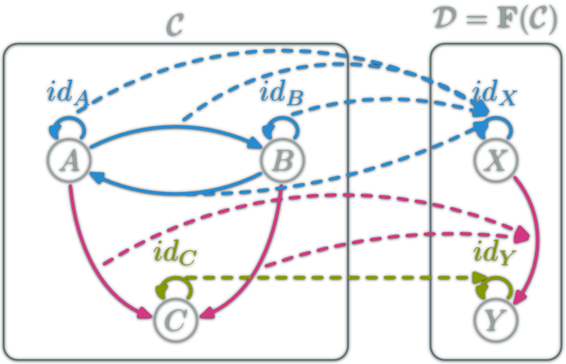
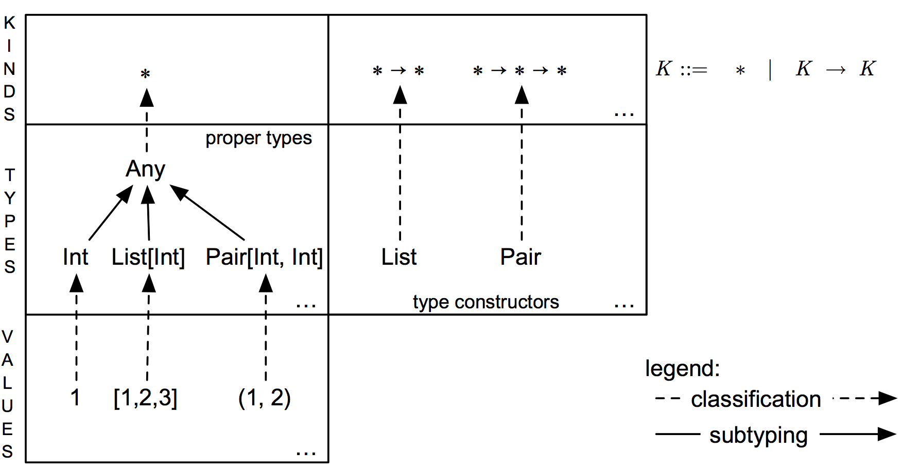

## what are type classes all about

[Zhenhao Li](https://www.linkedin.com/in/zhenhaoli/)
[<div></div>](http://www.connecterra.io/) 

<script src="http://ajax.googleapis.com/ajax/libs/jquery/1.9.1/jquery.min.js"></script>

*** =pnotes

This is the title page.

--- 

### About Me


<section>

---

Data scientist and engineer at Connecterra since Feb 2017

---

1.5 year in consulting at Accenture

---

M.Sc. in logic and PhD-in-progress in mathematical logic 

---

B.Eng. in Software Engineer from China 

---

Two years experience with Scala

</section>

---

### [](http://www.connecterra.io/) 


<section>

---

Insight into the planet using data

---

Better agriculture through technology

---

<a href="#/2" class="image">
  
</a> 
the dairy farming assistant

        
</section>

--- &vertical

### Why type classes are hard to understand
 
> * No backing formal theory
* Not from Scala originally
* No direct syntax support in Scala 
>


--- &vertical

### What are type classes

> A typeclass defines some behavior (like comparing for equality, comparing for ordering, enumeration) and then types that can behave in that way are made instances of that typeclass. The behavior of typeclasses is achieved by defining functions or just type declarations that we then implement. So when we say that a type is an instance of a typeclass, we mean that we can use the functions that the typeclass defines with that type.

Miran Lipovaca
[Learn You a Haskell for Great Good! ](http://learnyouahaskell.com/making-our-own-types-and-typeclasses#typeclasses-102)

***

### Example

```haskell
class Functor f where  
    fmap :: (a -> b) -> f a -> f b
```

f is a type of kind $$\begin{aligned}  * \rightarrow * \end{aligned}$$

a and b are types of kind $$ * $$

```haskell
instance Functor Maybe where  
    fmap f (Just x) = Just (f x)  
    fmap f Nothing = Nothing
    
```

```haskell
fmap (*2) (Just 200)
-- Just 400
```

*** 

### Just enough category theory

<a href="#" class="image">
  
</a> 

<small>http://yogsototh.github.io/Category-Theory-Presentation/categories/img/mp/functor-morphism.png</small>

--- &vertical

### Type system of Scala

<a href="#" class="image">
  
</a> 

[Generics of a Higher Kind](https://lirias.kuleuven.be/bitstream/123456789/186940/4/tcpoly.pdf)

***

### Functor type class in Scala

```scala
trait Functor[F[_]] {
    def def lift[A, B](f: A => B): F[A] => F[B]
}
```

```scala
// implementation for Option
implicit val functorForOption: Functor[Option] = new Functor[Option] {
    def lift[A, B](f: A => B): Option[A] => Option[B] = {
        case None    => None
        case Some(a) => Some(f(a))
    }
}
```

```scala
implicitly[Functor[Option]].lift((n: Int) => n * 2)(Some(200))
//res0: Option[Int] = Some(400)
```

<small>http://typelevel.org/cats/typeclasses/functor.html</small>


***

### Better Syntax?

Add 

```scala
object Functor{
    implicit def apply[F[_]](implicit functor: Functor[F]): Functor[F] 
                = functor
}
```
So we can write

```scala
Functor[Option].lift((n: Int) => n * 2)(Some(200))
//res1: Option[Int] = Some(400)
```


--- &vertical

#### But can we just write this?

```scala
Some(200) fmap ((n: Int) => n * 2)
//res3: Option[Int] = Some(400)
```

***

### here is the trick

```scala
trait FunctorSyntax[F[_], A]{
    def fmap[B](f: A => B): F[B]
}

object FunctorSyntax{
    implicit def apply[F[_], A](fa: F[A])(implicit functor: Functor[F])
        : FunctorSyntax[F, A] = new FunctorSyntax[F, A]{
            def fmap[B](f: A => B): F[B] = functor.lift(f)(fa)
        }
}
```

***

### We end up with 

```scala
Some(200).asInstanceOf[Option[Int]] fmap ((n: Int) => n * 2)
//res3: Option[Int] = Some(400)

// or

Some(200).map(identity) fmap ((n: Int) => n * 2) // or use map(a => a) 
//res4: Option[Int] = Some(400)
```

--- &vertical

### Summary

> - Type classes are about polymorphism.
> - Focus on behaviours (functions!) when writing your type classes  
> - Type parameters in a type class trait are "higher kind variables" 
> - Users can substitute those variables with new types or type constructors, 
only if they provide the implementation of the type class.
> - Very powerful when used with type level recursions; automatic generations of instances.

*** 

# Thank you! 


